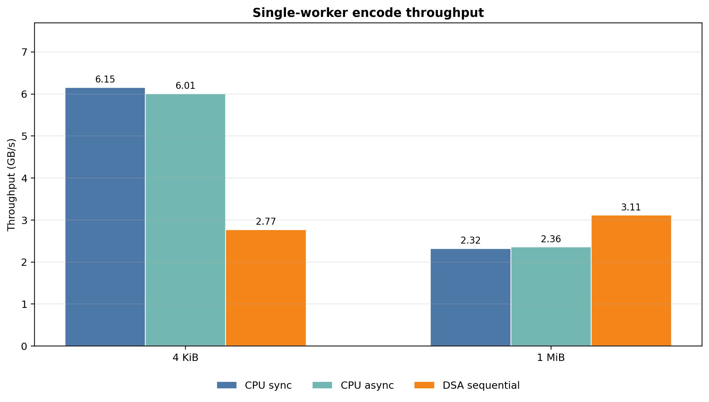
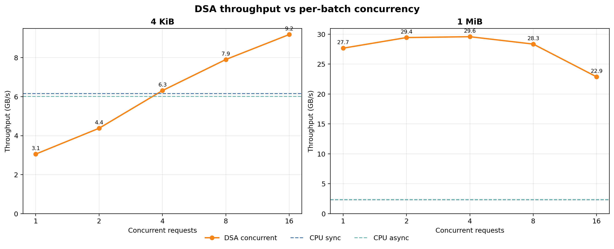
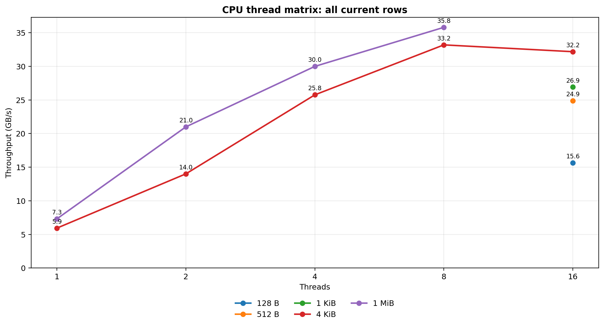
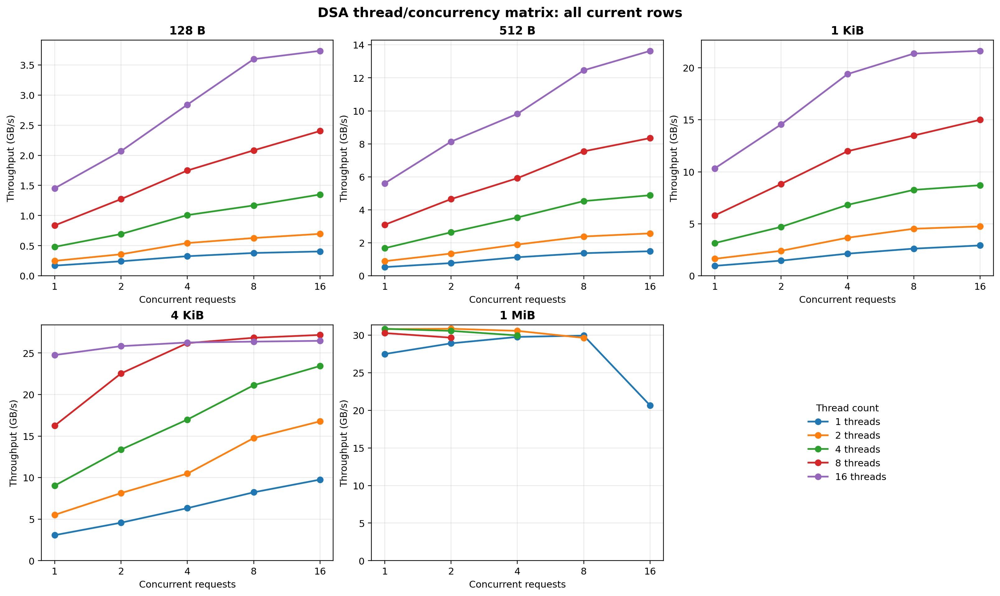

# Customized integration Criterion results

## At a glance

The customized integration benchmark (`accel-rpc/tonic/customized-integration-tests`) says:

- Async CPU Prost encoding is basically cost-neutral versus sync `Message::encode` in the measured rows.
- Sequential DSA is not enough for 4 KiB payload copies, but it already helps the 1 MiB byte payload.
- DSA becomes competitive only when the benchmark exposes enough independent payload copies through concurrent submission.
- CPU threading remains the best observed path through the filtered thread-matrix rows; DSA only wins against single-worker CPU baselines for large byte payloads.

## Data source

No benchmark was rerun for this note. The plots and tables use existing Criterion artifacts:

- `accel-rpc/tonic/target/criterion/*/new/benchmark.json`
- `accel-rpc/tonic/target/criterion/*/new/estimates.json`

The plotting script is:

- `docs/report/benchmarking/plot_customized_integration_results_2026_06_11.py`

Generated artifacts:

- `055.customized_integration_results_2026-06-11/single_worker_encode.png`
- `055.customized_integration_results_2026-06-11/dsa_concurrency_matrix.png`
- `055.customized_integration_results_2026-06-11/cpu_thread_matrix_all.png`
- `055.customized_integration_results_2026-06-11/dsa_thread_matrix_all.png`
- `055.customized_integration_results_2026-06-11/criterion_summary.csv`

Filtering rule: use only metadata-complete rows (`requests` or `requests_per_iter`, `bytes_per_request`, and `bytes_per_iter`) from benchmark groups still emitted by `benches/async_payload_encode.rs`, and require the request/byte metadata to match the formulas in that source file. Stale Criterion rows with obsolete `requests_per_iter` or `bytes_per_iter` metadata are excluded.

Throughput is `bytes_per_iter / mean_time`, reported as decimal GB/s. Request rate is logical requests per second from the benchmark metadata.

## 1. Single-worker encode paths

| Payload | Path | Requests/iter | Bytes/request | Mean | GB/s | Mreq/s |
|---|---:|---:|---:|---:|---:|---:|
| `small-bytes-4k` | CPU `Message::encode` | 4,088 | 4,105 | 2.727 ms | 6.15 | 1.499 |
| `small-bytes-4k` | async CPU `encode_async_ref` | 4,088 | 4,105 | 2.794 ms | 6.01 | 1.463 |
| `small-bytes-4k` | DSA submit+poll+complete | 4,088 | 4,105 | 6.054 ms | 2.77 | 0.675 |
| `large-bytes` | CPU `Message::encode` | 16 | 1,048,586 | 7.231 ms | 2.32 | 0.002 |
| `large-bytes` | async CPU `encode_async_ref` | 16 | 1,048,586 | 7.118 ms | 2.36 | 0.002 |
| `large-bytes` | DSA submit+poll+complete | 16 | 1,048,586 | 5.388 ms | 3.11 | 0.003 |

Interpretation: the async CPU surface is not the bottleneck. It is -2.4% on the 4 KiB row and +1.6% on the 1 MiB row versus sync CPU. Sequential DSA is a bad trade for 4 KiB copies but is already 1.34x the CPU sync throughput for the 1 MiB byte payload.

## 2. DSA per-batch concurrency

| Payload | Best concurrent requests | Best GB/s | Best Mreq/s | Crossover |
|---|---:|---:|---:|---|
| `small-bytes-4k` | 16 | 9.19 | 2.238 | Crosses the single-worker CPU baseline around `concurrent_requests=4`. |
| `large-bytes` | 4 | 29.58 | 0.028 | Beats the single-worker CPU baseline at every measured concurrency. |

Interpretation: DSA needs independent outstanding copies. For 4 KiB payloads, single-concurrent DSA is still behind CPU; by 16 concurrent requests it reaches 9.19 GB/s. For 1 MiB payloads, the useful range is 2-4 concurrent requests; 16 concurrent requests regresses.

## 3. Thread matrices: all current rows

These plots include every filtered row in the CPU and DSA thread-matrix groups, not just the maxima. The CSV remains the exact source for each point.

| Matrix | Rows plotted | Dimensions | Reading |
|---|---:|---|---|
| CPU thread matrix | 12 | payload × thread count | Current artifacts show full 1/2/4/8-thread ladders for `small-bytes-4k` and `large-bytes`; tiny-byte rows are present at 16 threads. |
| DSA thread/concurrency matrix | 114 | payload × thread count × concurrent requests | Most byte payloads improve with more threads and more concurrent requests; filtered `large-bytes` rows peak at 2 threads / 2 concurrent requests. |

Correction note: a stale Criterion row reported `threads=8 concurrent_requests=16 requests_per_iter=128`, which computed to 228.48 GB/s. The current benchmark source uses 16 requests per iteration for the large-byte thread matrix, so that stale aggregate row is excluded here.

## Conclusion

The current numbers support the async Prost encode shape: the CPU async path is not meaningfully slower than sync encoding, and DSA can pay off when payload copies are large or sufficiently concurrent. They do **not** support using DSA for tiny payloads, sequential 4 KiB copies, or beating the best CPU-threaded rows with the filtered thread-matrix artifacts. For publication-quality numbers, rerun from a clean Criterion directory so retained stale benchmark IDs cannot confuse readers.
